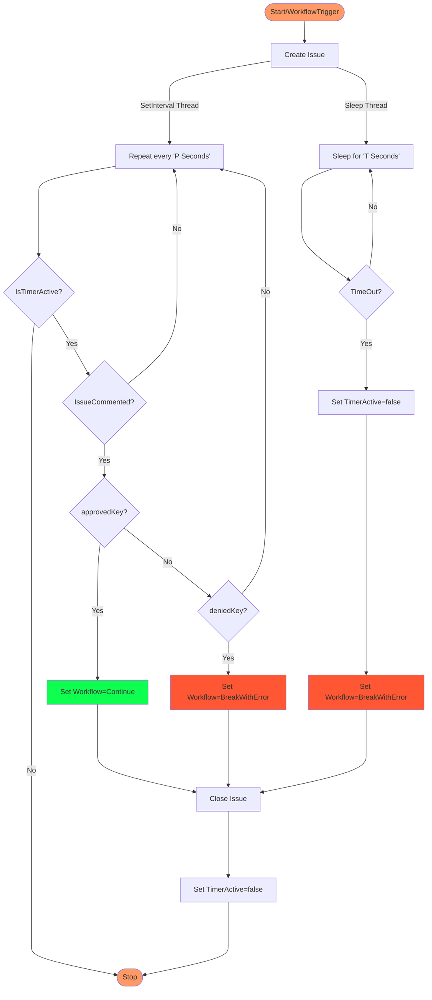

# Manual Workflow Approval

[](https://github.com/trstringer/manual-approval/actions/workflows/ci.yaml)

Pause a GitHub Actions workflow and require manual approval from one or more approvers before continuing.

This is a very common feature for a deployment or release pipeline, and while [this functionality is available from GitHub](https://docs.github.com/en/actions/managing-workflow-runs/reviewing-deployments), it requires the use of environments and if you want to use this for private repositories then you need GitHub Enterprise. This action provides manual approval without the use of environments, and is freely available to use on private repositories.

*Note: This approval duration is subject to the broader 72 hours timeout for a workflow. So keep that in mind when figuring out how quickly an approver must respond.*

The way this action works is the following:

1. Workflow comes to the `manual-approval` action.
1. `manual-approval` will create an issue in the containing repository and assign it to the `approvers`.
1. If and once all approvers respond with an approved keyword, the workflow will continue.
1. If any of the approvers responds with a denied keyword, then the workflow will exit with a failed status.

* Approval keywords - "approve", "approved", "lgtm", "yes"
* Denied keywords - "deny", "denied", "no"

These are case insensitive with optional punctuation either a period or an exclamation mark.

In all cases, `manual-approval` will close the initial GitHub issue.

## Manual Approval Action Flow Chart



## Usage

```yaml
steps:
  - uses: yog4prog/custom-starter-template@v1
    with:
      owner: 'Yog4Prog'
          org: 'Yog4Prog'
          repo: 'custom-starter-template'
          approvers: 'Yog4Prog'
          secret: ${{ secrets.AUTH_TOKEN }}
          timeout-minutes: '1'
          issue_title: 'A Scan has a failure.. Please approve to proceed'
          body_message: 'Found an Issue while performing SCA Scan'
          labels: "scan failure,approval required"
```

- `approvers` is a comma-delimited list of all required approvers. An approver can either be a user or an org team. (*Note: Required approvers must have the ability to be set as approvers in the repository. If you add an approver that doesn't have this permission then you would receive an HTTP/402 Validation Failed error when running this action*)
- `labels` is a comma-delimited list of labels available in the repositpry, if the label doesn't exist then corresponding label is created.
- `issue-title` is a string that will be appened to the title of the issue.


## Timeout

If you'd like to force a timeout of your workflow pause, you can specify `timeout-minutes` at either the [step](https://docs.github.com/en/actions/using-workflows/workflow-syntax-for-github-actions#jobsjob_idstepstimeout-minutes) level or the [job](https://docs.github.com/en/actions/using-workflows/workflow-syntax-for-github-actions#jobsjob_idtimeout-minutes) level.

For instance, if you want your manual approval step to timeout after an hour you could do the following:

```yaml
steps:
  - uses: trstringer/manual-approval@v1
    timeout-minutes: 60
    ...
```

## Limitations

* While the workflow is paused, it will still continue to consume a concurrent job allocation out of the [max concurrent jobs](https://docs.github.com/en/actions/learn-github-actions/usage-limits-billing-and-administration#usage-limits).
* A job (including a paused job) will be failed [after 6 hours](https://docs.github.com/en/actions/learn-github-actions/usage-limits-billing-and-administration#usage-limits).
* A paused job is still running compute/instance/virtual machine and will continue to incur costs.


